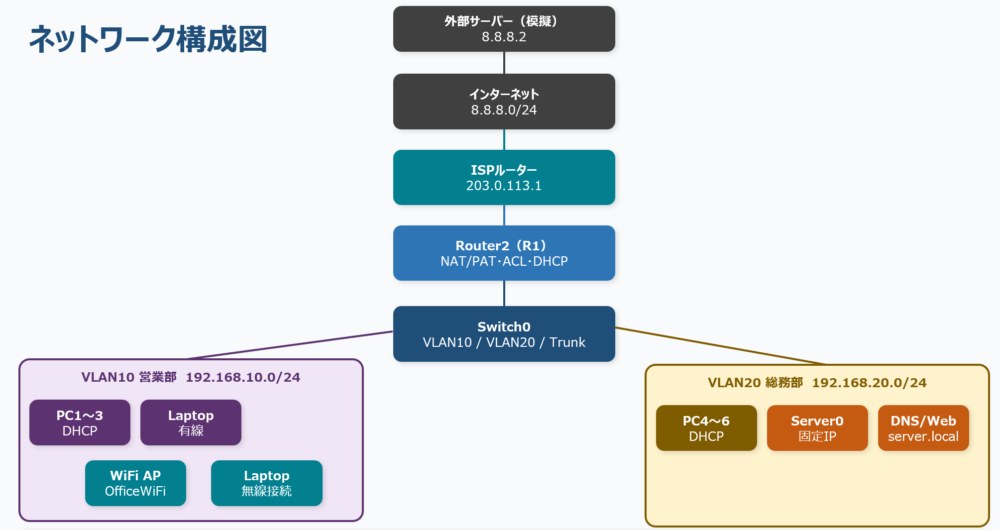
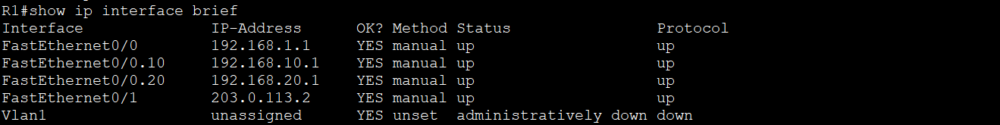
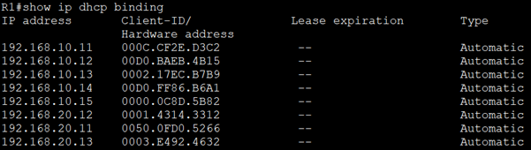
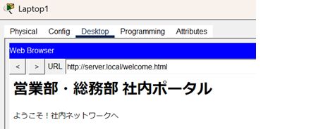
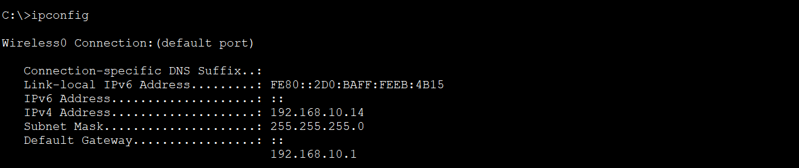
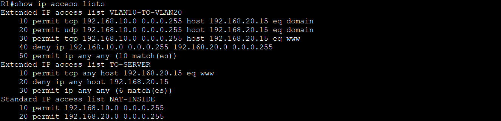
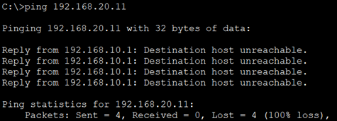
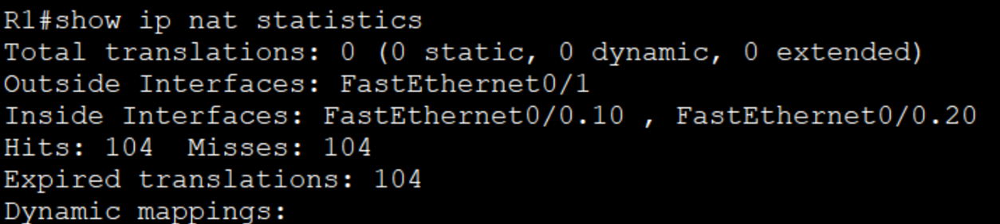
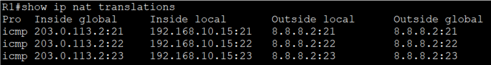

# 小規模オフィスネットワーク構築


## システム概要

営業部と総務部をVLANで分離し、Router-on-a-StickによるVLAN間ルーティングを実装。

ACLで最小権限アクセスを実現し、DHCP・DNS・NATを含む実運用を想定したネットワークを構築。

---

## 構成図



---

## 実現したこと

| 項目 | 内容 |
|---|---|
| ✅ 部署間分離 | VLANで営業部・総務部のトラフィックを分離 |
| ✅ DNS名前解決 | server.localでWebサーバーにアクセス可能 |
| ✅ HTTPアクセス制御 | ACLで80番ポートのみ許可 |
| ✅ NATによる外部通信 | プライベートIPを隠蔽して外部と通信 |

---
## 使用技術

| 技術 | 内容 |
|---|---|
| VLAN | 部署ごとのネットワーク分離 |
| Router-on-a-Stick | サブインターフェースによるVLAN間ルーティング |
| DHCP | ルーターによるIPアドレス自動配布 |
| DNS / HTTP | Server0による名前解決とWebサービス |
| 無線LAN | WiFiアクセスポイントによる無線接続 |
| ACL | アクセス制御リストによるセキュリティ設計 |
| NAT/PAT | プライベートIPの隠蔽と外部通信 |

---

## ネットワーク設計

### IPアドレス設計

| 機器 | インターフェース | IPアドレス | 備考 |
|---|---|---|---|
| Router2 | Fa0/0.10 | 192.168.10.1/24 | VLAN10ゲートウェイ |
| Router2 | Fa0/0.20 | 192.168.20.1/24 | VLAN20ゲートウェイ |
| Router2 | Fa0/1 | 203.0.113.2/30 | 外部インターフェース |
| Server0 | Fa0 | 192.168.20.15/24 | 固定IP |

### VLAN設計

| VLAN | 用途 | ネットワーク | ゲートウェイ |
|---|---|---|---|
| VLAN10 | 営業部 | 192.168.10.0/24 | 192.168.10.1 |
| VLAN20 | 総務部・サーバー | 192.168.20.0/24 | 192.168.20.1 |

---

## 実装内容

### 1. VLAN / Router-on-a-Stick

**目的**
部署ごとにネットワークを分離し、情報漏えいリスクを低減するためにVLANを設定しました。
サブインターフェースを使ったRouter-on-a-Stickによりケーブル1本でVLAN間ルーティングを実現しています。

**主な設定**
```
! スイッチ側
interface FastEthernet0/2
 switchport mode access
 switchport access vlan 10

interface FastEthernet0/3
 switchport mode trunk

! ルーター側
interface FastEthernet0/0.10
 encapsulation dot1Q 10
 ip address 192.168.10.1 255.255.255.0
```



---

### 2. DHCP

**目的**
PCのIP設定を自動化し、管理コストを削減するためにDHCPを設定しました。
固定IPが必要なServer0は除外アドレスとして設定しています。

**主な設定**
```
ip dhcp excluded-address 192.168.10.1 192.168.10.10
ip dhcp excluded-address 192.168.20.1 192.168.20.10

ip dhcp pool VLAN10
 network 192.168.10.0 255.255.255.0
 default-router 192.168.10.1
 dns-server 192.168.20.15

ip dhcp pool VLAN20
 network 192.168.20.0 255.255.255.0
 default-router 192.168.20.1
 dns-server 192.168.20.15
```



---

### 3. DNS / Webサーバー

**目的**
IPアドレスではなくドメイン名でサーバーにアクセスできるようにするため、
Server0にDNSとWebサーバーを設定しました。

**設定内容**
- DNSサーバにAレコードを登録し、server.local を 192.168.20.15 に名前解決できるよう設定
- HTTPサーバを構築し、http://server.local/welcome.html で社内ポータルへアクセス可能



---

### 4. 無線LAN

**目的**
ノートPCやモバイル端末からも社内ネットワークに接続できるよう、
WiFiアクセスポイントを追加しました。

**設定内容**
- SSID：OfficeWiFi
- 認証：WPA2-PSK
- 接続VLAN：VLAN10（営業部）



---

### 5. ACL（アクセス制御）

**目的**
部署間の不正アクセス防止と、サーバーへの通信を必要最小限に制限するため
ACLを設定しました。

**設計方針**
- 営業部（VLAN10）から総務部（VLAN20）への直接アクセスを拒否
- Server0への通信はHTTP（80番）のみ許可、それ以外は拒否

**主な設定**
```
ip access-list extended VLAN10-TO-VLAN20
 10 permit tcp 192.168.10.0 0.0.0.255 host 192.168.20.15 eq 53
 15 permit udp 192.168.10.0 0.0.0.255 host 192.168.20.15 eq 53
 16 permit tcp 192.168.10.0 0.0.0.255 host 192.168.20.15 eq www
 20 deny ip 192.168.10.0 0.0.0.255 192.168.20.0 0.0.0.255
 30 permit ip any any
```




---

### 6. NAT/PAT

**目的**
内部のプライベートIPアドレスを外部に公開しないようにするため、
NAT/PATを設定しました。複数の端末が1つのグローバルIPを共有します。

**主な設定**
```
ip access-list standard NAT-INSIDE
 permit 192.168.10.0 0.0.0.255
 permit 192.168.20.0 0.0.0.255

ip nat inside source list NAT-INSIDE interface FastEthernet0/1 overload
```



---

## セキュリティ設計の考え方

本構成では以下の3段階でセキュリティを実装しています。

```
段階①：VLAN分離
　部署ごとにネットワークを分離し、横断的なアクセスを制限

段階②：ACL
　VLAN間通信をルールベースで制御し、最小権限の原則を実現

段階③：NAT/PAT
　内部IPを外部に公開しないことで、外部からの直接攻撃を防止
```

## 動作検証結果

| 検証項目 | 内容 | 結果 | 確認方法 |
|---|---|---|---|
| VLAN10 → Server0 HTTP | 営業部PCからWebサーバーへのHTTPアクセス | ✅ 成功 | http://server.local/welcome.html をブラウザで確認 |
| VLAN10 → Server0 Ping | 営業部PCからサーバーへのpingを拒否 | 🚫 拒否 | ping 192.168.20.15 → timeout |
| VLAN10 → VLAN20 PC | 営業部から総務部PCへの直接アクセスを拒否 | 🚫 拒否 | ping 192.168.20.11 → unreachable |
| DNS名前解決 | server.localのドメイン名でアクセス | ✅ 成功 | ping server.local → IPに解決 |
| インターネット接続 | NAT/PATによる外部通信 | ✅ 成功 | ping 8.8.8.2 → 応答あり |
| DHCP自動配布 | VLANごとにIPアドレスを自動取得 | ✅ 成功 | show ip dhcp binding で確認 |
| WiFi接続 | 無線LANからネットワークへの接続 | ✅ 成功 | PC Wireless でOfficeWiFiに接続 |

> 設計通りの動作をすべて確認。拒否項目もACLによる意図的な制御です。

---

## 詰まった点と解決方法

| 問題 | 原因 | 解決方法 |
|---|---|---|
| server.localにアクセスできない | ACLがDNS通信も拒否していた | port53（TCP/UDP）を明示的に許可 |
| NATが機能しない | サブインターフェースにip nat insideが未設定 | 各サブインターフェースに個別に設定 |
| WiFi接続できない | 有線NICが残ったままだった | Physical画面でNICを差し替え |

---

## 今後追加したい機能

- [ ] ASAファイアウォールの導入
- [ ] OSPFによる動的ルーティング
- [ ] 冗長化構成（STP / HSRP）
- [ ] VPN接続

---

## 使用ツール

- Cisco Packet Tracer
